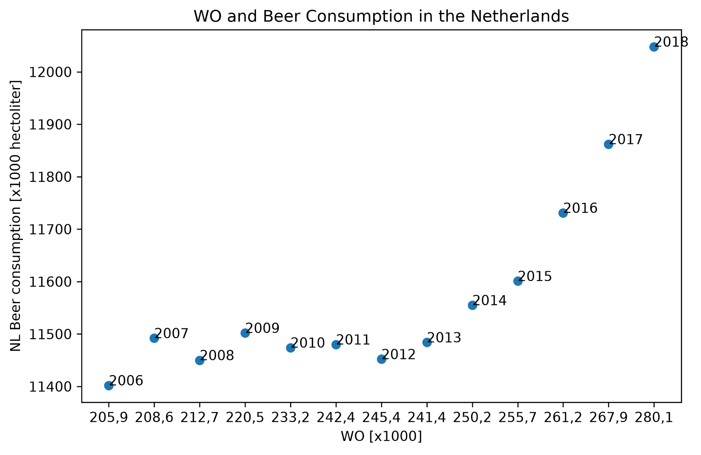

## Student ID: 16767527

## Paper titles

MCC Van Dyke et al. (2019): The Rise of Coccidioides: Forces Against the Dust Devil Unleashed.
JT Harvey (2002), Applied Ergonomics: An Analysis of the Forces Required to Drag Sheep over Various Surfaces.
DW Ziegler et al. (2005): Reading Acquisition, Developmental Dyslexia, and Skilled Reading Across Languages: A Psycholinguistic Grain Size Theory.

## Plot

The scatter plot shows the relationship between WO and beer consumption in the Netherlands from the years 2006 to 2018. Both WO and beer consumption in the Netherlands generally increase over time. There could be a positive correlation. However, this does not necessarily mean that one causes the other.
